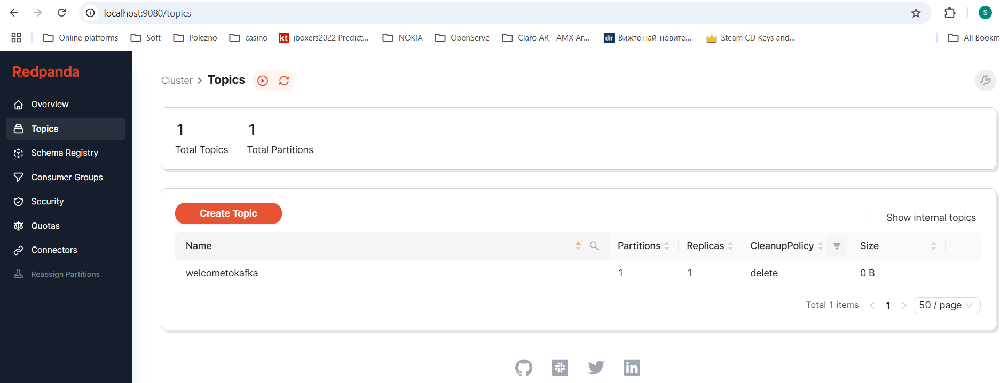

# How to test it
We have 2 Kafka demos - one is pure Java Kafka, the other one is Kafka with Spring.

1. Run `docker-compose up` in the relevant project directory - the compose.yaml file should be executed. 
2. We have the GUI tool RedPanda for displaying the Kafka messages at http://localhost:9080/topics - loaded from the compose.yaml file.

3. We have logs enabled thanks to the `logback.xml` file in the resources

# Getting Started

### Reference Documentation
For further reference, please consider the following sections:

* [Official Gradle documentation](https://docs.gradle.org)
* [Spring Boot Gradle Plugin Reference Guide](https://docs.spring.io/spring-boot/3.3.2/gradle-plugin)
* [Create an OCI image](https://docs.spring.io/spring-boot/3.3.2/gradle-plugin/packaging-oci-image.html)
* [Spring Web](https://docs.spring.io/spring-boot/docs/3.3.2/reference/htmlsingle/index.html#web)
* [Spring for Apache Kafka](https://docs.spring.io/spring-boot/docs/3.3.2/reference/htmlsingle/index.html#messaging.kafka)

### Guides
The following guides illustrate how to use some features concretely:

* [Building a RESTful Web Service](https://spring.io/guides/gs/rest-service/)
* [Serving Web Content with Spring MVC](https://spring.io/guides/gs/serving-web-content/)
* [Building REST services with Spring](https://spring.io/guides/tutorials/rest/)

### Additional Links
These additional references should also help you:

* [Gradle Build Scans – insights for your project's build](https://scans.gradle.com#gradle)

