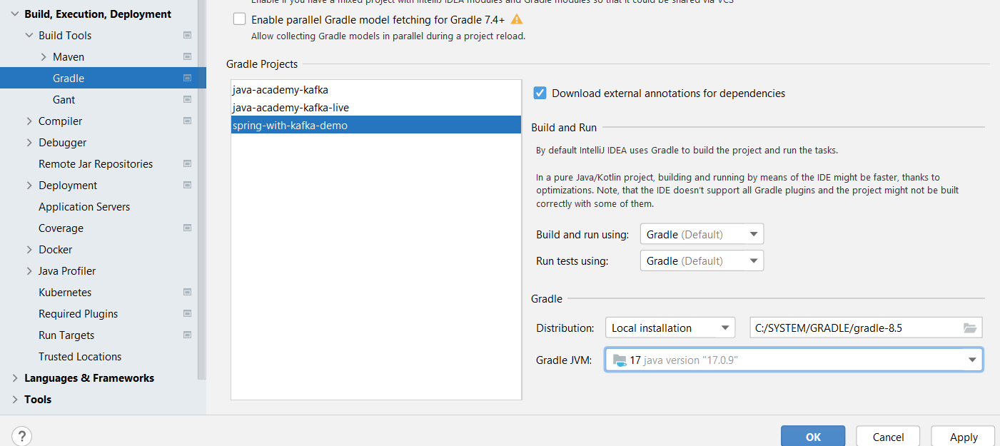

# How to test it
We have 3 Kafka demos - two of them are Java Kafka, the other one is Kafka with Spring.

1. Run `docker-compose up` in the relevant project directory - the compose.yaml file should be executed. 
2. We have the GUI tool RedPanda for displaying the Kafka messages at http://localhost:9080/topics - loaded from the `compose.yaml` file.

3. We have logs enabled thanks to the `logback.xml` file in the resources

You might need to adjust the Gradle

You can experiment on the apps and watching what happens in the RedPanda GUI.
